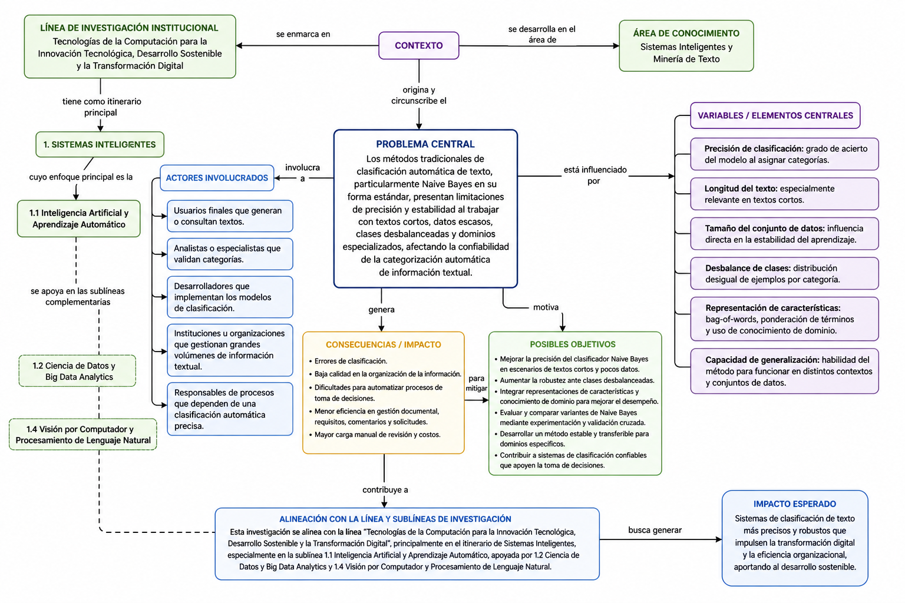

# Introducción

La clasificación automática de texto es una tarea fundamental dentro de la minería de texto y los sistemas inteligentes, ya que permite organizar grandes volúmenes de información textual de manera eficiente, consistente y escalable. En este contexto, el modelo Naive Bayes continúa siendo una alternativa importante por su simplicidad y eficiencia, aunque presenta limitaciones en escenarios complejos como textos cortos, datos escasos y clases desbalanceadas [2]-[6].

Este trabajo se enmarca en la línea de investigación institucional **“Tecnologías de la Computación para la Innovación Tecnológica, Desarrollo Sostenible y la Transformación Digital”**, definida para la Carrera de Computación de la Universidad Nacional de Loja, dentro del itinerario de **Sistemas Inteligentes** y con relación directa a la sublínea **1.1 Inteligencia Artificial y Aprendizaje Automático** [1]. También se vincula de manera complementaria con las sublíneas de **Ciencia de Datos y Big Data Analytics** y **Visión por Computador y Procesamiento de Lenguaje Natural**, por el tipo de problema abordado y la naturaleza textual del dominio [1].

# Mapa conceptual

# Desarrollo conceptual

El **problema central** se ubica en la **clasificación automática de texto con Naive Bayes**, especialmente cuando se trabaja con textos cortos, conjuntos de datos pequeños, clases desbalanceadas y dominios específicos. La literatura muestra que el rendimiento del clasificador puede verse afectado por la estimación de parámetros y por la independencia condicional asumida por el modelo, lo que reduce su precisión en ciertas condiciones [2], [4], [5].

El **contexto** de la investigación corresponde al área de **Sistemas Inteligentes y Minería de Texto**, dentro de la línea institucional de la Carrera de Computación [1]. Esta línea promueve el estudio y aplicación de tecnologías computacionales emergentes para la innovación tecnológica, la transformación digital y la solución de problemas reales, incluyendo inteligencia artificial, ciencia de datos, ingeniería de software y computación aplicada [1]. En ese marco, la investigación sobre Naive Bayes resulta pertinente porque aporta conocimiento sobre métodos de clasificación aplicables a entornos con información textual limitada y variabilidad semántica [2]-[6].

Los **actores involucrados** en el problema incluyen a los usuarios finales que generan o consultan textos, los analistas o especialistas que validan categorías, los desarrolladores que implementan los modelos de clasificación, las instituciones que gestionan grandes volúmenes de información y los responsables de procesos que dependen de una clasificación precisa [2], [4]. Cada uno de estos actores se relaciona con la utilidad práctica del clasificador, ya que el resultado del sistema impacta en la organización, recuperación y uso de la información.

Las **variables o elementos centrales** del problema son la precisión de clasificación, la longitud del texto, el tamaño del conjunto de datos, el desbalance de clases, la representación de características y la capacidad de generalización. Estas variables condicionan el desempeño del modelo y determinan su utilidad en escenarios reales [2], [3], [5]. Por ejemplo, la normalización por documento y la ponderación de características mejoran el rendimiento del clasificador en colecciones de texto estándar, mientras que el uso de ontologías y la ponderación profunda de características permiten mejorar la clasificación en contextos con pocos datos o con texto breve [2], [3], [5].

A partir de este análisis, los **posibles objetivos** de investigación se orientan a mejorar la precisión del clasificador Naive Bayes, aumentar su robustez frente a textos cortos y clases desbalanceadas, integrar representaciones de características más eficaces y evaluar variantes del modelo mediante experimentación cuantitativa [2]-[6]. Además, la evidencia también sugiere que una comparación rigurosa entre clasificadores requiere enfoques estadísticos apropiados, como los propuestos en la comparación bayesiana de desempeño [4].

En síntesis, el mapa conceptual muestra que el problema de investigación no debe entenderse de forma aislada, sino como parte de un sistema de relaciones entre contexto, actores, variables y objetivos. Esta articulación permite justificar la pertinencia del estudio dentro de la línea institucional de investigación y dentro de la sublínea de inteligencia artificial y aprendizaje automático [1].

# Conclusión

El mapa conceptual elaborado organiza de forma clara el problema de investigación y lo relaciona con su entorno académico e institucional. Se evidencia que Naive Bayes es una técnica efectiva para clasificación de texto, pero su desempeño depende de la calidad de la representación textual, del tamaño del conjunto de datos y del tratamiento de condiciones como el desbalance de clases [2]-[6]. Asimismo, la investigación se alinea con la línea institucional de la Carrera de Computación, especialmente con la sublínea de inteligencia artificial y aprendizaje automático [1]. Por ello, el mapa conceptual no solo cumple una función descriptiva, sino también orientadora para delimitar el problema y proyectar sus objetivos de mejora.

# Referencias

[1] Universidad Nacional de Loja, *Propuesta de Línea de Investigación: "Tecnologías de la Computación para la Innovación Tecnológica, Desarrollo Sostenible y la Transformación Digital"*, Carrera de Computación, Facultad de la Energía, las Industrias y los Recursos Naturales No Renovables, Loja, Ecuador, Aug. 2025.

[2] S. B. Kim, K. S. Han, H. C. Rim, and S. H. Myaeng, “Some effective techniques for naive bayes text classification,” *IEEE Transactions on Knowledge and Data Engineering*, vol. 18, no. 11, pp. 1457–1466, Nov. 2006, doi: 10.1109/TKDE.2006.180.

[3] K. Sangounpao and P. Muenchaisri, “Ontology-Based Naive Bayes Short Text Classification Method for a Small Dataset,” in *Proc. 20th IEEE/ACIS Int. Conf. on Software Engineering, Artificial Intelligence, Networking and Parallel/Distributed Computing (SNPD)*, Toyama, Japan, 2019, pp. 53–58, doi: 10.1109/SNPD.2019.8935711.

[4] E. Frank and R. R. Bouckaert, “Naive Bayes for Text Classification with Unbalanced Classes,” in *Proc. 10th Eur. Conf. on Principles and Practice of Knowledge Discovery in Databases (PKDD)*, Berlin, Germany, 2006, pp. 503–510, doi: 10.1007/11871637_49.

[5] D. Zhang, J. Wang, E. Yilmaz, X. Wang, and Y. Zhou, “Bayesian performance comparison of text classifiers,” in *Proc. 39th Int. ACM SIGIR Conf. on Research and Development in Information Retrieval (SIGIR)*, Pisa, Italy, 2016, pp. 15–24, doi: 10.1145/2911451.2911547.

[6] L. Jiang, C. Li, S. Wang, and L. Zhang, “Deep feature weighting for naive Bayes and its application to text classification,” *Engineering Applications of Artificial Intelligence*, vol. 52, pp. 26–39, Jun. 2016, doi: 10.1016/j.engappai.2016.02.002.